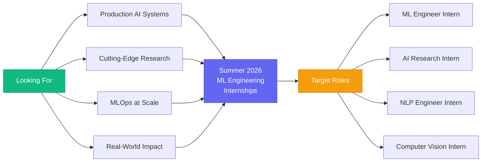

<div align="center">

# Hi, I'm Sejal Barshikar

### MS Computer Science @ Northeastern University | AI/ML Engineer
### Specializing in NLP & Computer Vision


[](https://sej07.github.io/Portfolio)
[](https://linkedin.com/in/sejal-barshikar)
[](mailto:sejalbarshikar@gmail.com)
[](https://github.com/sej07)


</div>

---

## About Me

```python
class SejalBarshikar:
    def __init__(self):
        self.education = "MS Computer Science @ Northeastern University"
        self.graduation = "December 2027"
        self.gpa = "3.83/4.0"
        self.specialization = ["NLP", "Computer Vision", "Multimodal AI"]
        self.research_lab = "Augmented Cognition Lab @ NEU"
        self.status = "Actively seeking Summer 2026 ML Engineering Internships"
    
    def what_i_do(self):
        return [
            "Build production-ready ML systems from scratch",
            "Implement research papers (Seq2Seq, Transformers, CNNs)",
            "Deploy AI models with FastAPI, Docker & Hugging Face",
            "Collaborate on physics-aware vision-language models research"
        ]
    
    def published_research(self):
        return {
            "ICCS 2024": "Code Summarization Using Attention-based Keyword Memory Networks",
            "ICICC 2024": "Intelligent Resource Optimization in Serverless Computing"
        }
```

---

## 🛠️ Technical Arsenal

<div align="center">

### Core Languages


### ML/DL Frameworks


### Computer Vision & NLP


### MLOps & Deployment


### Tools & Platforms


</div>

---

## Education & Research

<table>
<tr>
<td width="50%">

### MS Computer Science
**Northeastern University** | *Dec 2027*  
- GPA: **3.83/4.0**  
- Focus: AI/ML, NLP, Computer Vision

</td>
<td width="50%">

**🎓 Previous Education**  
BE in AI & Data Science  
Savitribai Phule Pune University | GPA: **8.65/10.0**

</td>
</tr>
</table>

---


## 🎯 Summer 2026 Internship Goals

<div align="center">



</div>

### What I'm Looking For:

**Build production AI systems** that solve real-world problems  
**Collaborate with experienced ML engineers** on cutting-edge research  
**Deploy models at scale** using modern MLOps practices  
**Work on challenging NLP, computer vision, or multimodal AI** projects  

---

## Let's Connect!

<div align="center">

### 🌐 Find Me Online

<a href="https://sej07.github.io/Portfolio">
  
</a>
<a href="https://linkedin.com/in/sejal-barshikar">
  
</a>
<a href="mailto:sejalbarshikar@gmail.com">
  
</a>
<a href="https://github.com/sej07">
  
</a>

<br><br>

### 📬 Open to Opportunities

**Internship Inquiries:** [sejalbarshikar@gmail.com](mailto:sejalbarshikar@gmail.com)  
**Research Collaboration:** Open to interesting projects  
**Coffee Chats:** Always happy to discuss AI/ML  


</div>

---


</div>
